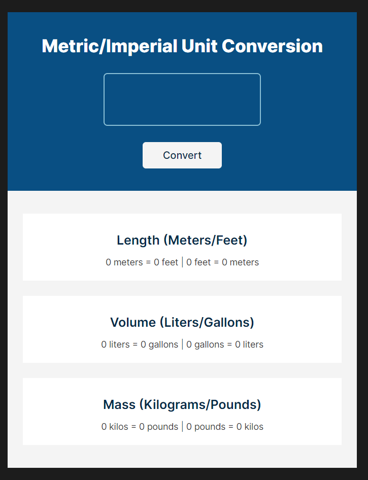
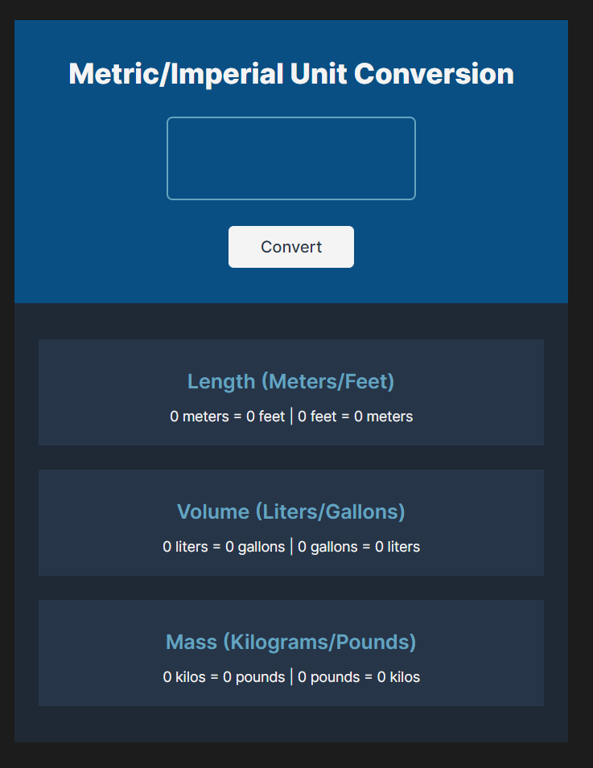
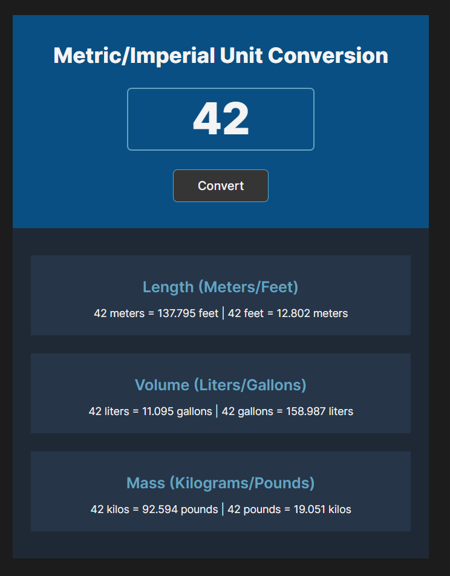

# Scrimba - The Frontend Developer Carrer Path - Module 3 - Unit Converter project

Hello and welcome! Thank you for stopping by.🤠

This is a solution to the Scoreboard projects from _Module 3 - JavaScript challenges - part 3 chapter_ of the [The Frontend Career Path](https://scrimba.com/learn/frontend).

## Table of contents

- [Overview](#overview)
  - [The project](#the-challenge)
  - [Screenshot](#screenshot)
  - [Links](#links)
- [My process](#my-process)
  - [Built with](#built-with)
  - [What I learned](#what-i-learned)
  - [Continued development](#continued-development)
- [Author](#author)
- [Acknowledgments](#acknowledgments)
- [About Scrimba](#about-scrimba)

## Overview

### The project

Users should be able to:

- Input a number (**the limit is five-digit!**) and get the conversion.
- See converted values of length, volume and mass.
- Input only numerals.
- Input a dot for decimals.
- See the light or dark design of the application, according to its browser settings.

### Screenshot

Light mode design


Dark mode design


State: Active


### Links

- Solution URL: [Github Repository](https://github.com/PetrValenta92/unit-corverter)
- Live Site URL: [Github Pages](https://petrvalenta92.github.io/unit-corverter/)

## My process

### Built with

- Semantic HTML5 markup
- CSS custom properties
- CSS media queries
- CSS utility classes
- Vanilla JavaScript
  - addEventListener
  - template string
  - alert function
- Flexbox

### What I learned

On the project, I mainly practiced how to work with .addEventListener() method and template strings, and I learned an alert() function in JS. Also I practiced my knowledge of HTML and CSS and learned how to change webapp's modes between light and dark.

Media query for dark mode:

```css
@media (prefers-color-scheme: dark) {
  :root {
    --container-bg-color: rgb(31 41 55);
    --converter-title-color: rgb(244 244 244);
    --unit-input-color: rgb(244 244 244);
    --unit-input-border-color: rgb(97 165 194);
    --unit-input-border-hover-color: rgb(244 244 244);
    --convert-btn-color: rgb(39 53 73);
    --convert-btn-hover-color: rgb(244 244 244);
    --convert-btn-border-hover-color: rgb(97 165 194);
    --unit-bg-color: rgb(39 53 73);
    --unit-title-color: rgb(97 165 194);
    --unit-text-color: rgb(244 244 244);
  }
}
```

The output of the conversion acording to user's input:

```js
function render(inputNum, foot, meter, gallon, liter, pound, kilo) {
  lengthOutputEl.textContent = `${inputNum} meters = ${foot.toFixed(
    3
  )} feet | ${inputNum} feet = ${meter.toFixed(3)} meters`;

  volumeOutputEl.textContent = `${inputNum} liters = ${gallon.toFixed(
    3
  )} gallons | ${inputNum} gallons = ${liter.toFixed(3)} liters`;

  massOutputEl.textContent = `${inputNum} kilos = ${pound.toFixed(
    3
  )} pounds | ${inputNum} pounds = ${kilo.toFixed(3)} kilos`;
}
```

### Continued development

In the future, I would like to add an option for users to choose exactly which conversion they are interested in. Furthermore, I would like to expand the offer of conversions and also I would like to add a switch button for users to choose between light and dark modes.

## Author

- Website - _to be added..._
- GitHub - [@PetrValenta92](https://github.com/PetrValenta92)
- LinkedIn - [@valentapetr](https://www.linkedin.com/in/valentapetr/)
- Instagram - [@petr.codes](https://www.instagram.com/petr.codes/)

## Acknowledgments

I would love to thank whole [Scrimba](https://scrimba.com) team for such amazing project they have created. I want to thank the Scrimba community and specialy the [Junior Guru Community](https://junior.guru/) community! 🐣 Special thanks to [Vzhůru dolů](https://www.vzhurudolu.cz/) team for very nice [How on web dark mode - Czech only!](https://www.vzhurudolu.cz/prirucka/dark-mode) article. It helped me a lot!

## About Scrimba

At Scrimba our goal is to create the best possible coding school at the cost of a gym membership! 💜
If we succeed with this, it will give anyone who wants to become a software developer a realistic shot at succeeding, regardless of where they live and the size of their wallets 🎉
The Frontend Developer Career Path aims to teach you everything you need to become a Junior Developer, or you could take a deep-dive with one of our advanced courses 🚀

- [Our courses](https://scrimba.com/allcourses)
- [The Frontend Career Path](https://scrimba.com/learn/frontend)
- [Become a Scrimba Pro member](https://scrimba.com/pricing)

Happy Coding!
